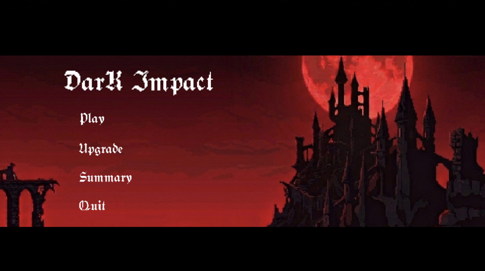
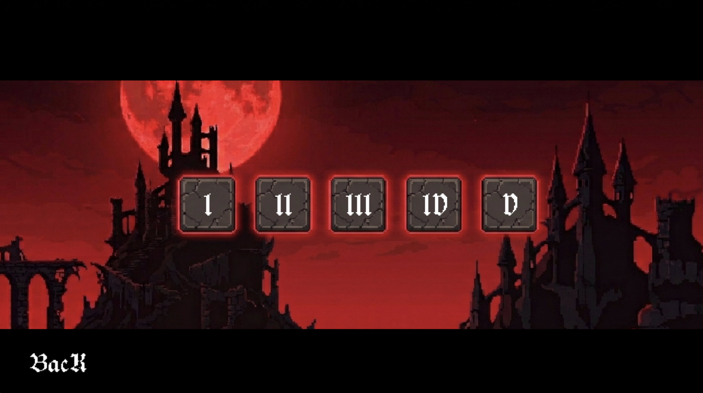
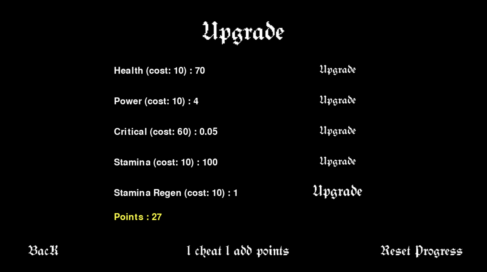
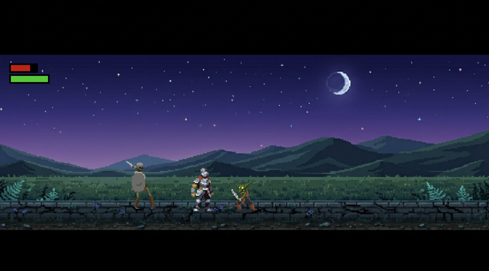
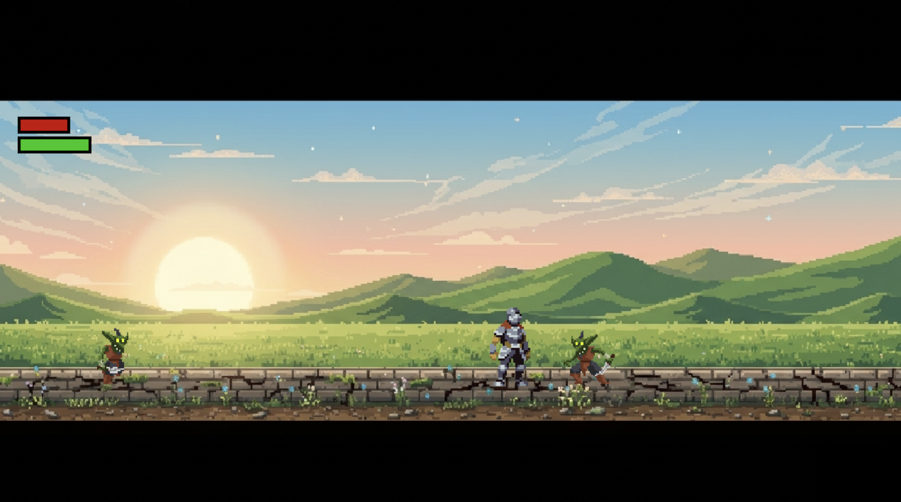
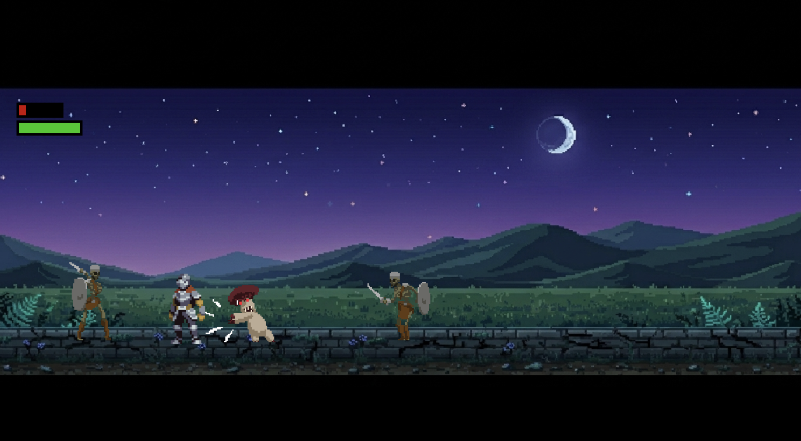
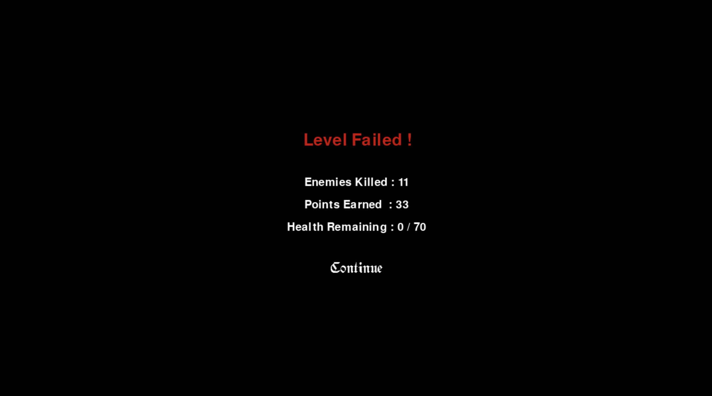
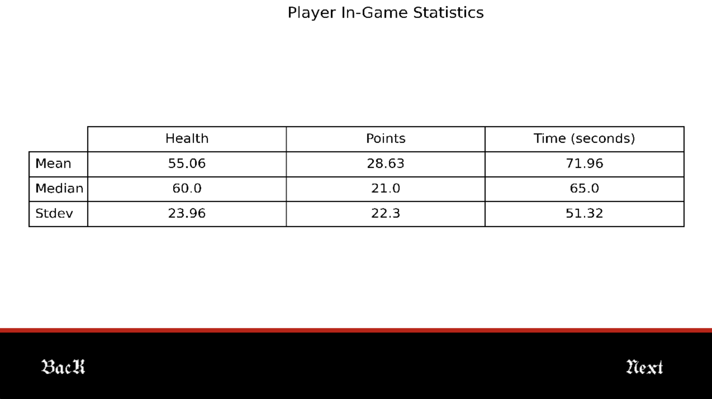

# Project Description: Dark Impact

## 1. Project Overview

- **Project Name:** Dark Impact
- **Brief Description:** Dark Impact is a 2D side-scrolling action-RPG built with Python and Pygame. Players control a knight navigating through increasingly difficult levels, battling various fantasy creatures and powerful bosses. 

  The game features a robust combat system involving stamina management, diverse enemy types, and a permanent progression system where players can upgrade their stats using points earned in battle. A unique feature of the project is the integration of a full data-science suite that tracks player performance and generates visual reports using Pandas and Matplotlib.

- **Problem Statement:** Many modern action games prioritize accessibility to the point where the sense of genuine achievement is lost, often providing a "power fantasy" that requires little effort. Dark Impact addresses this by reintroducing high-stakes difficulty and a steep learning curve. By focusing on punishing combat mechanics and formidable boss encounters that require pattern recognition and precise timing, the game forces players to grow through failure. It restores the "triumph of overcoming," ensuring that every victory is earned through genuine skill and perseverance rather than luck.

- **Target Users:** Players who enjoy challenging 2D combat, fans of pixel-art aesthetics, individuals who enjoy the Soulsborne genre, and developers or students interested in seeing how database management and data visualization can be integrated into a functional game engine.

- **Key Features:**
  - Fast-paced 2D combat with jumping, dashing, and combo attacks.
  - Resource management system involving Health and Stamina.
  - Progressive difficulty across multiple stages and advanced Boss AI.
  - Automated Data Visualization generates Bar, Pie, and Line charts of gameplay stats.

- **Screenshots:**

  ### Gameplay
  
  
  
  
  
  
  
  
  
  
  
  

  ### Data Visualization
  
  
  
  
  

- **Proposal:** [Project Proposal](./proposal.pdf)

- **YouTube Presentation:** *https://www.youtube.com/watch?v=DZbk7HASFBg*

---

## 2. Concept

### 2.1 Background
- **Why this project exists:** To combine traditional action-heavy gameplay with modern data analytics in a skill-based environment.
- **What inspired the project:** Classic "Souls-like" and Metroidvania titles where positioning and resource management are key to survival.
- **Importance of solving this problem:** It addresses the lack of challenge in modern "power fantasy" games by restoring the rewarding feeling of overcoming difficult obstacles through skill.

### 2.2 Objectives
- Implement a responsive 2D physics and combat engine using Pygame.
- Create an extensible Enemy and Boss framework.
- Develop a persistent database schema for character progression and session history.
- Integrate data analysis libraries (Pandas/Matplotlib) directly into the game UI.
- Deliver a polished aesthetic using high-quality pixel art and AI-generated environmental assets.

---

## 3. UML Class Diagram
The UML class diagram illustrates the inheritance structure between the base `Enemy` class and its specialized subclasses, as well as the relationship between the `System` controller and the various UI and Data modules.

**Submission Requirement:**
- [UML Class Diagram](./uml.pdf)

---

## 4. Object-Oriented Programming Implementation

- **System:** Central engine controller for Pygame initialization, scaling, and global drawing utilities.
- **Level:** Primary game loop controller managing backgrounds, enemy waves, and collision.
- **Background:** Utility class for loading and retrieving stage-specific background surfaces.
- **Player:** Core entity handling state machine transitions (movement, combat) and resource management.
- **Enemy:** Base class for standard hostile AI implementing patrolling and detection logic.
- **Boss:** Advanced entity subclass with multi-phase combat logic and specialized state management.
- **Individual Entities (Skeleton, Goblin, Mushroom, Big Mushroom, Flying Eye, Minotaur, Golem, Tarnished Widow):** Specialized subclasses implementing unique attributes and frame-specific behaviors.
- **GameDB:** Database abstraction layer for SQLite connections and data management.
- **PlayerStats:** Specialized class tracking permanent progression (Health, Power, Critical, etc.).
- **EnemyDefeated:** Data container recording specific kill counts per species for metrics.
- **InGameTimeStamp:** Time-series class capturing snapshots of player status at fixed intervals.
- **PointUsage:** Tracks distribution of spent points across upgrade categories.
- **Plotter:** Visualization engine utilizing Pandas and Matplotlib to generate PNG reports.
- **Summary:** Reporting interface that presents generated visualizations to the player.
- **Upgrade:** Persistent menu for interacting with the database to enhance attributes.
- **Selection:** Interface for stage navigation and level unlocking.
- **Button:** Modular UI component handling collision and event-driven triggers.
- **SpriteLoaders:** Asset managers for slicing sprite sheets into indexed animation frames.

---

## 5. Statistical Data

### 5.1 Data Recording Method
All gameplay data is recorded by the `StatsLogger` and database classes into an SQLite database (`histories.db`). Data is collected via **Event-Based Logging** (immediate recording of kills/purchases), **Periodic Snapshots** (intervals for performance trends), and **Persistence** (sqlite3 management across sessions).

### 5.2 Data Features
- **Player Progression:** Permanent stats including health, power, critical, and stamina.
- **Combat Metrics:** Enemy defeat counts categorized by species (Skeleton, Goblin, Bosses, etc.).
- **Time-Series:** Real-time performance snapshots (health and points at specific timestamps).
- **Economy:** Spending habits regarding point distribution in the upgrade shop.

---

## 6. Changed Proposed Features (Optional)

- **Dynamic Boss Personalization:** Added a `BossNameGennerator` to provide randomized, unique titles for bosses.
- **Stamina-Based Action Economy:** Implemented a resource cost for dashing and attacking to add tactical depth.
- **Automated Visualization Suite:** Integrated a full `Plotter` engine to automatically generate visual PNG reports instead of raw numbers.

---

## 7. External Sources

### Sprites & Artwork
- **Fantasy Knight (Player):** [aamatniekss](https://aamatniekss.itch.io/fantasy-knight-free-pixelart-animated-character)
- **Monsters (Skeleton, Goblin, Mushroom, Eye):** [LuizMelo](https://luizmelo.itch.io/monsters-creatures-fantasy)
- **Bosses (Minotaur, Golem):** [xzany](https://xzany.itch.io/)
- **Tarnished Widow Boss:** [Penusbmic](https://penusbmic.itch.io/the-dark-series-the-tarnished-widow-boss)
- **Backgrounds:** AI-generated assets via Google Gemini.

### Libraries & Frameworks
- **Pygame:** Core game loop and 2D rendering engine.
- **Pandas & NumPy:** Data analysis and numerical processing.
- **Matplotlib & Seaborn:** Generation of bar, pie, and line charts.
- **SQLAlchemy:** Database engine abstraction and connectivity.

### Music & Ambient
- **Ambients & Boss Themes:** Generated via Suno AI.