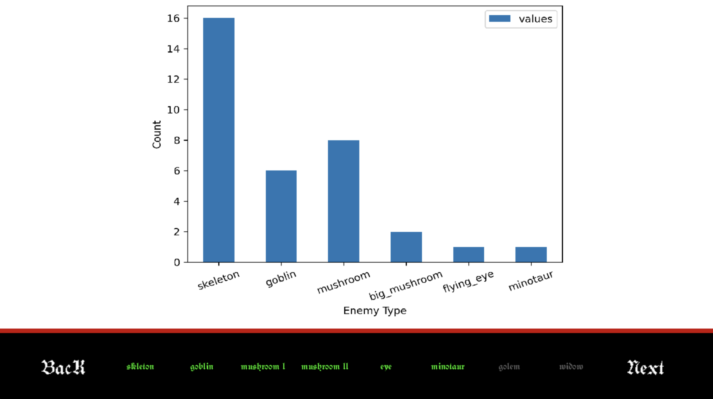
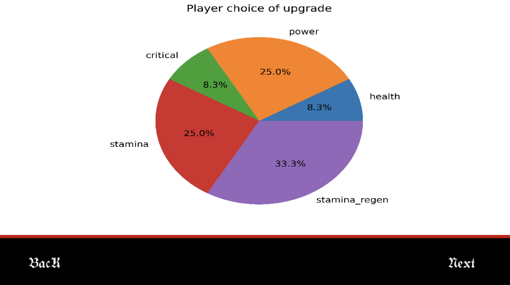
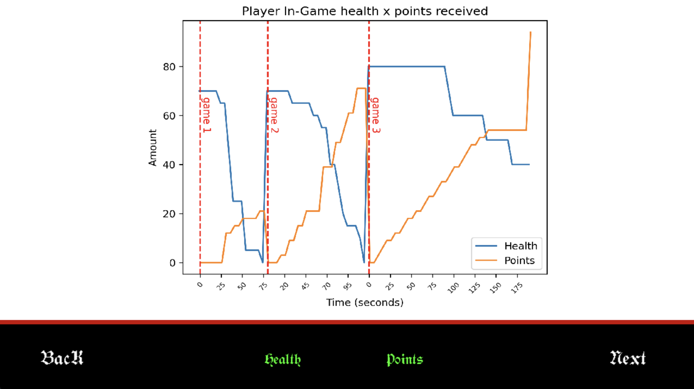

# Visualization

## Overview
The Statistics Menu provides data-driven feedback on player performance. It pulls real-time data from the `histories.db` SQLite database to visualize combat efficiency and character progression across all sessions.

---

## Graph Components

### 1. Enemy Types Defeated

- **Purpose & Importance:** Tracks total eliminations per species to validate encounter balance. It maps the player's combat footprint by comparing the frequency of standard mobs against rare boss encountered.

### 2. Player Choice of Upgrade

- **Purpose & Importance:** Identifies user upgrade priorities. By visualizing point distribution, it reveals the player's preferred "build" and the perceived value of different character attributes.

### 3. Health x Points Received

- **Purpose & Importance:** Illustrates the relationship between health maintenance and point acquisition. It identifies performance "heartbeats," showing when point gains spike relative to damage taken.

### 4. Performance Statistics Table

- **Purpose & Importance:** Provides a mathematical summary of career performance. Using Mean, Median, and Stdev, it quantifies player consistency and the skill gap between stages.

---

## Data Summary

| Category | Source Table | Importance |
| :--- | :--- | :--- |
| **Combat** | `EnemyDefeated` | Measures engagement across all enemy types. |
| **Progression** | `PointUsage` | Tracks investment trends and character meta. |
| **Survival** | `InGameTimeStamp` | Correlates survival time with wealth earned. |
| **Session** | `PlayerStats` | Quantifies career consistency and outliers. |